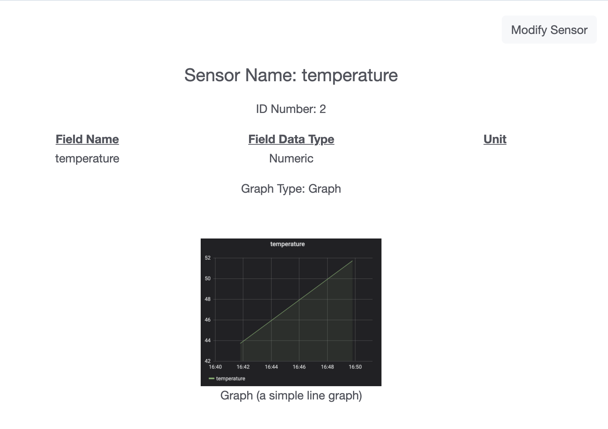
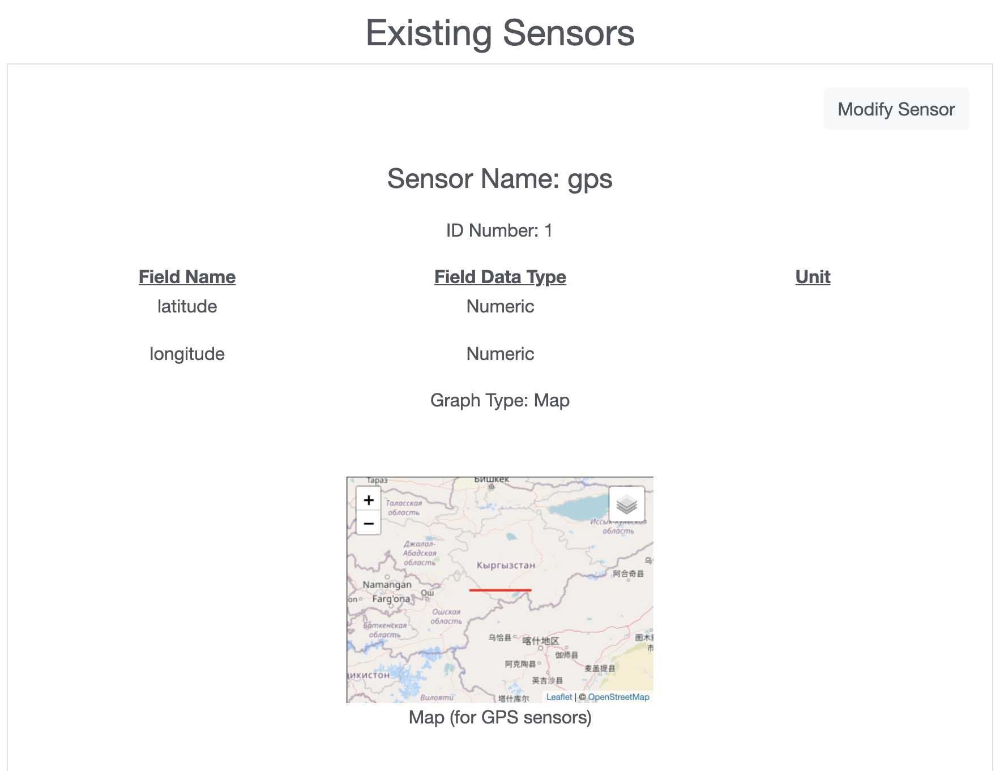

# Configure Grafana

### What is Grafana?
- Grafana is the time-series visualization tool that we have integrated into Mercury
 to allow you to visualize your sensor data. 
- Grafana can be hosted (by a service like AWS, Heroku, or Grafana) or run locally
 without
 internet connectivity.   
- To learn more about Grafana: https://www.grafana.com/

### Configure Grafana Features
- From Mercury, you can directly access and manage your Grafana dashboards. 

The instructions below will explain how to set up a new Grafana instance and manage
 event dashboards and sensor panels. 
 
### Contents</h3>

1. [Grafana Set-Up](#1.-Grafana-Set-Up)
    - A. Install Grafana 
    - B. Install TrackMap Plug-in
    
2. Add a Grafana Host to Mercury</a></li>
3. Manage Grafana Hosts
4. Manage Event Dashboards
5. Manage Sensor Panels
    - Graph types
6. An Example 

### 1. Grafana Set-Up
#### A. Install Grafana
- You can install Grafana on your local machine or host Grafana.
- Options for hosting include:
    - GrafanaCloud Hosted Grafana: Hosting is done directly by Grafana. (Note: For
     free accounts, there is a limit of 5 dashboards.)
    - Deploy Grafana in a docker container using a hosting service like AWS Elastic
     Beanstalk or Heroku.
     
##### 1. Install Grafana on your machine and start the Grafana server

[Grafana installation guides](https://grafana.com/docs/grafana/latest/installation/)

##### MacOS:
- [MacOS instructions](https://grafana.com/docs/grafana/latest/installation/mac/)
```
brew update
brew install grafana
brew services start grafana
```

##### Debian/Ubuntu:
- [Debian/Ubuntu instructions](https://grafana.com/docs/grafana/latest/installation/debian/)  
1. Install Grafana: 
```
sudo apt-get install -y apt-transport-https
sudo apt-get install -y software-properties-common wget

wget -q -O - https://packages.grafana.com/gpg.key | sudo apt-key add -
sudo add-apt-repository "deb https://packages.grafana.com/oss/deb stable main"
sudo apt-get update
sudo apt-get install grafana
```
2. Start the Grafana service using `systemd`, `init.d`, or by executing the binary:

- Use `systemd`:

```
# To start the service and verify that the service has started:
sudo systemctl daemon-reload
sudo systemctl start grafana-server
sudo systemctl status grafana-server

# Configure the Grafana server to start at boot:
sudo systemctl enable grafana-server.service
```

- Use `init.d`:

```
# To start the service and verify that the service has started:
sudo service grafana-server start
sudo service grafana-server status

# Configure the Grafana server to start at boot:
sudo update-rc.d grafana-server defaults
```

- Execute the binary

```
# Note: The grafana-server binary .tar.gz needs the working directory to be the root install directory where the binary and the public folder are located.
./bin/grafana-server web
```

##### Windows:
[Windows instructions](https://grafana.com/docs/grafana/latest/installation/windows/)
1. [Download Open Source Edition of Grafana for Windows](https://grafana.com/grafana/download?platform=windows)
2. Install with Windows installer or install the standalone Windows binary (the instructions provide links for each).
3. To run Grafana, open your browser and go to the Grafana port (http://localhost:3000/ is default) and then follow the instructions in [Getting Started](https://grafana.com/docs/grafana/latest/guides/getting_started/).

#### 2. Login to Grafana
- The default location of grafana is http://localhost:3000/
- The default login is:
```
username: admin
password: admin
``` 

#### 3. Use the admin API token to create a Grafana instance in the app
1. Launch local version of app (`python3 manage.py runserver`) or go to deployment. 
2. Go to Configure Grafana page
3. Create a new Grafana instance by filling out the form: 

- **Label**: Whatever you like (e.g. 'local')
- **Hostname**: http://localhost:3000

- **Username**: Grafana username (default is `admin`)
- **Password**: Grafana password (default is `admin`)

**OR**

- **API token**: Generate an admin API token through the Grafana UI and then paste it
 here (instructions directly below)

#### How to Create an Admin API Token (not needed if using username and password!)
1. Go to http://localhost:3000/org/apikeys
2. Create a new administrative API key: 

- Click **Add API key**:
    - Provide a **key name** (anything you like)
    - Change **role** from Viewer to **Admin**
    - Leave **"time to live"** empty
-  Click **Add**: 
    - Copy the generated admin API key (e.g. `eyJrIjoiR2R5cERqY0NHVm9tZXhZMU11anlkaVFXVXJ2Rkc1MTAiLCJuIjoiYXBpX2tleSIsImlkIjoxfQ==`) and store it somewhere.

4. You should now see a Grafana instance listed in the table or an error message indicating what went wrong.  

#### B. Install TrackMap Plug-in
- This set-up step is required if you want to use GPS panels. 
- If you are running local grafana:
    - Invoke:
    ```
    grafana-cli plugins install pr0ps-trackmap-panel
    ```
    - Restart the grafana server (see the specific instruction for your OS above)
- If you're on remote grafana:
    - Navigate to the [TrackMap plugin](https://grafana.com/grafana/plugins/pr0ps-trackmap-panel)
    - `Install Plugin`

### 2. Add a Grafana Host
1. Go to the Add Grafana Host tab.
2. Fill out the Add Grafana Host form (Fig 1):
3. Hit Submit.
4. Once we validate your Grafana details, we will:
    - Create an Event Dashboard for each of your events.
    - Fill each dashboard with Sensor Panels.


> Fig 1. Add Grafana Host form

- **Label:** A name for this grafana host (e.g. Local,
Remote).
- **Hostname:** The Grafana hostname for this host (e.g.
http://localhost:3000, http://abc123.grafana.net).
- **Username:** Your Grafana username. (Grafana's default 
username is admin.
- **Password:** Your Grafana password. (Grafana's default 
password is admin.)
- **API key**: An admin API key for this Grafana instance.

- You may provide either:
    - Username/password, OR
    - API key
- BUT, when using a Grafana instance **hosted by Grafana Cloud**, you will need to
 use an API key. Otherwise, we recommend just using your Grafana username and password. 
 
To create an admin API token: 
1. Go to http://localhost:3000/org/apikeys
2. Create a new administrative API key:
    - Click `Add API key`
    - Provide a key name (anything you like)
    - Change role from Viewer to Admin
    - Leave "time to live" empty
    - Click `Add`
    - Copy the generated admin API key (e.g
        . eyJrIjoiR2R5cERqY0NHVm9tZXhZMU11anlkaVFXVXJ2Rkc1MTAiLCJuIjoiYXBpX2tleSIsImlkIjoxfQ==) and store it somewhere.

### 3. Manage Grafana Hosts
Use the Existing Grafana Hosts view to manage all of your configured Grafana
 instances (Fig 2a)
1. Go to the Configure Grafana --> Existing Grafana Hosts
2. Choose Show Dashboards to view and manage the dashboards and panels for a host
 (Fig 2b)
 
 
 > Fig 2a.Grafana host table - displays all of the active grafana instances. Hit
> `Show
> dashboards` to see a Grafana host's dashboards.
 - Delete: Deletes the GFConfig. Wipes the Grafana instance of all dashboards and datasources. 

### 4. Manage Event Dashboards 
- **Note:** Each time you create an event in Mercury, a dashboard will be created in
 Grafana
 automatically 
 with sensor panels for all of your sensors at that time.

 
 > Fig 2b. The Local Grafana instance has one event, Baja.
 The Baja dashboard has 3 sensor panels: GPS, temperature, and speed.

- `Delete Dashboard`: Deletes the entire dashboard from Grafana.
(Once you delete a dashboard, you can create it again, but 
any of your previous setting changes will be lost.)
- `Update Panels`: For choosing which sensor panels to display 
in the dashboard. Choose from the Sensor Panels list. All of
the panels will be restored to their default settings.
- `Reset Panels`: Reset the dashboard to include all of the 
currently available sensors. All of the panels will be 
restored to their default settings. 
- `View Dashboard in Grafana`: View and edit the dashboard 
in your Grafana instance.


#### Add an Event Dashboard (Fig 3)
1. Create an Event (if you haven't already, see `Configure Events` to learn how).
2. Go to `Existing Grafana Hosts`--> `Show Dashboards` for the 
Grafana host you are trying to add the dashboard to.
3. If the event dashboard doesn't already exist in Grafana, 
you will see an option to add a dashboard (Fig 3). 
4. Select an event from the dropdown and `Add Dashboard for this Event`

> Fig 3. Create Dashboard form for the Baja event.

### 5. Manage Sensor Panels

#### Graph Types
Sensor panels may be displayed as:
1. **Time-series**: 

- This is the default graph type for sensor panels. 
- This graph type is appropriate sensor types with any number of fields (1
    +). Each field will be graphed as a separate line with a different color.

2. **Gauge**:

- Used to display the **current** value of a sensor. 
- **Note**: This gauge will display the most recent value in the current time range
 you are viewing in the Grafana UI
     . Make sure your time range is set for `<some time>-now`, so that you are
      getting the most recent value (we set the dashboard to this level of zoom for
       you by default, but users who need to change the zoom will need to be
        aware of this) **You can always use the `Reset Dashboard` option to refresh
         your dashboard to its default settings.
    
    - This graph type can only be used for sensor types with a **single
    value**.
3. **Map**:

> TrackMap panel for displaying GPS (latitude/longitude)
data. 

- As you add, remove, and update your sensors and events in
 Mercury, you will see the changes in Grafana.
- For details on how to create different sensor types, see the `Configure Sensors
` documentation. 

### 6. A Walkthrough Example
- Although you may set up Grafana, events, and sensors in any order in Mercury, below
 is an
 example sequence of set-up steps to create a Grafana dashboard for a new event and
  fill the dashboard with sensor panels.

1. We created 3 sensor panels in Mercury by going to `Configure Sensors` and filling
 out the `Add New Sensor` form three times. (See the `Configure Sensors` documentation
  for instructions on how to create a new sensor.)
  Here is what
  the
  new sensors  look
  like: 
 
 
 

2. We create a new event called "Test Event" in Mercury by going to `Manage Events
` and filling out the `Create Event` form. (See the `Configure Events` documentation
  for instructions on how to create a new event.) Here is the newly created event:


3. We create a new Grafana instance called "Local" to Mercury by going to
 `Configure
 Grafana` --> `Add Grafana Host` and filling out the form. (See the `Add Grafana Host
 ` section of this documentation
  for instructions on how to add a new Grafana host.): 


4. When the Grafana instance is built, Mercury will automatically check whether any
 events exist. The "Test Event" exists, so a dashboard will be created with the same
  name. Next, Mercury will check whether any sensors exist. 3 panels exist, so 3
   sensor panels will be created and added to the "Test Event" dashboard
   
5. We can view
    the new "Test Event" dashboard by going to `Configure Grafana` --> `Existing
     Grafana Hosts` --> `Show Dashboards`: 
     


6. We can view the new "Test Event" Dashboard in Grafana by following the
 `View Dashboard in Grafana` link below the name of the event. 

7. Here is the "Test Event" Dashboard in Grafana:  

- In Grafana, we see the same 3 panels that we created previously in Mercury:
1. **gps**: A `map` panel displaying coordinates.
2. **temperature**: A `graph` panel displaying a time-series.
3. **speed**: A `gauge` panel displaying the most recent value recorded.